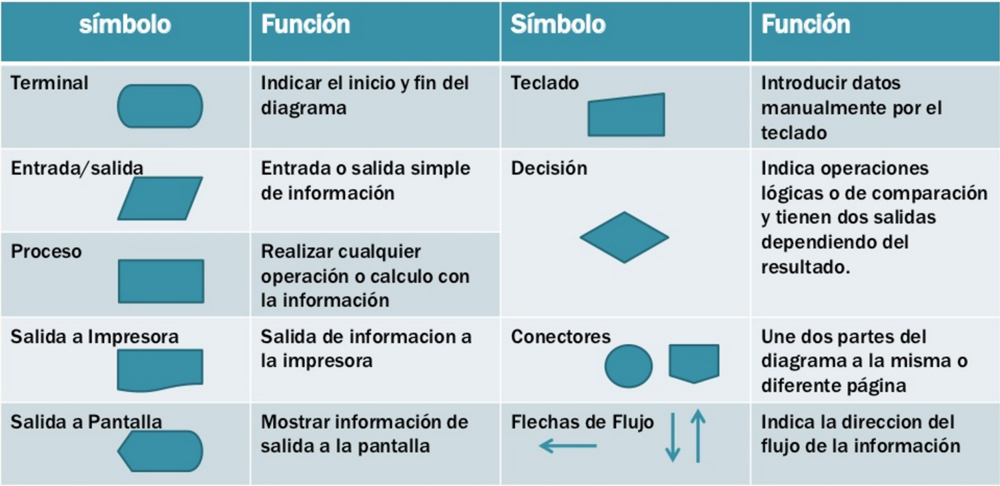

algoritmos
1. Todo diagrama de flujo debe tener un **inicio y** un **fin.** 
2. Las líneas utilizadas para indicar la dirección del flujo del  diagrama deben ser rectas: verticales u horizontales. 
3. Todas las líneas utilizadas para indicar la dirección del flujo  del diagrama deben estar conectadas. La conexión puede  ser a un símbolo que exprese lectura, proceso, decisión,  impresión, conexión o fin del diagrama. 
4. El diagrama de flujo debe construirse de arriba hacia abajo  (*top-down*) y de izquierda a derecha (*left to right* ).
5. La notación utilizada en el diagrama de flujo debe ser  independiente del lenguaje de programación. 
6. Al realizar una tarea compleja, es conveniente poner  comentarios que expresen o ayuden a entender lo que  hayamos hecho. 
7. Si la construcción del diagrama de flujo requiriera más de  una hoja, debemos utilizar los conectores adecuados y  enumerar las páginas correspondientes. 
8. No puede llegar más de una línea a un símbolo  determinado

