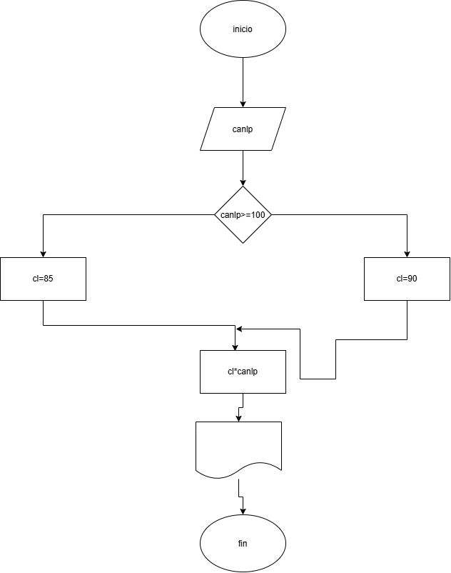
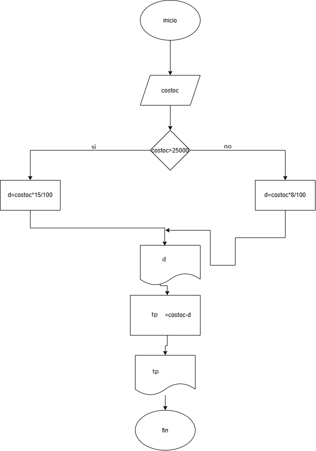
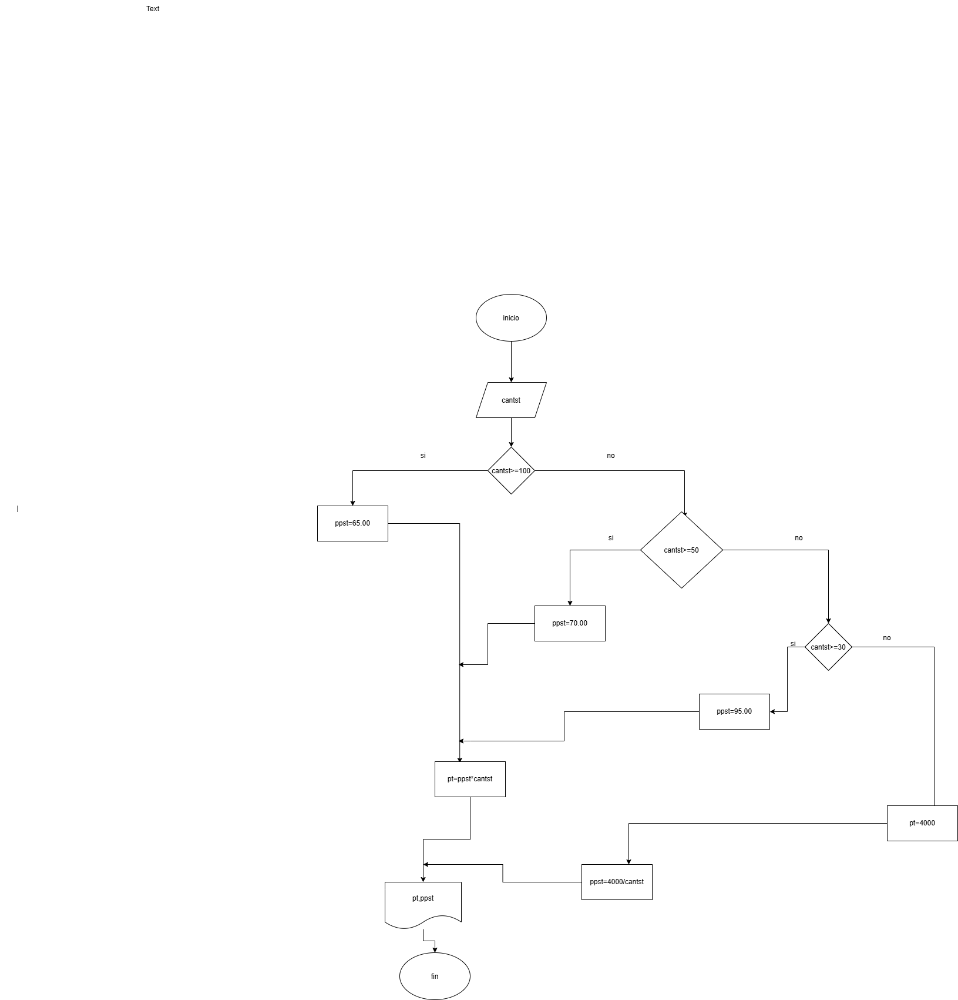

## taller dragramas de flujo

en las siguientes imagenes se muestra el desarrollo de las actividades sobre diagramas de flujo para la creacionn de algoritmos:

1.

2.  
NOMBRE	TIPO	DESCRIPCIÒN
canlp	entero	cantidad lapices
cl	punto flotante	costo lapices
tp	punto flotante	total a pagar

3.
NOMBRE	TIPO	DESCRIPCIÒN
costoc	punto flotante	costo compras
d	punto flotante	descuento
tp	punto flotante	total a pagar

4.
NOMBRE	TIPO	DESCRIPCIÒN
cantst	entero	cantidad estudiantes
ppst	punto flotante	precio por estudiante
pt	punto flotante	precio total

